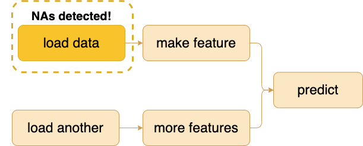

## Block 1: Introduction to Ploomber

8:00 - 9:00

> We'll motivate the project and explain why investing in organizing our project as a modular pipeline (multiple scripts/notebooks) instead of a big script/notebook helps us develop faster and enhances collaboration.


### Before we start...

Let's check your setup


### 1.1 Refactoring a legacy notebook

```sh
cd material/1.1
soorgeon refactor notebook.ipynb --df-format parquet
```

Open [material/1.1/pipeline.html](material/1.1/pipeline.html)

```sh
cd material/1.1
ploomber plot --backend d3
```

Open [material/1.1/pipeline.yaml](material/1.1/pipeline.yaml)


### 1.2 The `pipeline.yaml` file

The `pipeline.yaml` file is where we declare the tasks in our pipeline. `soorgeon refactor` generated one for us since we refactored an existing notebook, but if we were to start a project from scratch we'd create it manually:

```sh
from pathlib import Path
from IPython.display import Markdown

def display(path):
    """Utility function to display files
    """
    path = Path(path)
    content = path.read_text()
    ext = path.suffix[1:]
    return Markdown(f'```{ext}\n# content of {str(path)}\n\n{content}\n```')

display('material/1.1/pipeline.yaml')
```


### 1.2 The command-line interface

```sh
ploomber --help
```

```sh
cd material/1.1
ploomber build
```

```sh
cd material/1.1/output
ls
```

We can also use the Python API (it updates in real time!):

```python
from ploomber.spec import DAGSpec

dag = DAGSpec('material/1.1/pipeline.yaml').to_dag()
dag.build(force=True)
```

Most commands in the CLI have an equivalent method in the Python API:

```sh
cd material/1.1
ploomber status
```

```python
dag.status()
```

<!-- #region -->

### Using Ploomber from JupyterLab, VSCode or PyCharm

[Documentation](https://docs.ploomber.io/en/latest/user-guide/editors.html)

```sh
ploomber nb --inject
```

### Pipeline parametrization

Static `param`:

```yaml
# content of pipeline.yaml

- source: tasks/load.ipynb
  product:
    df: output/load-df.parquet
    nb: output/load.ipynb
  params:
    sample: true
```

Placeholder `param`:

```yaml
# content of pipeline.yaml

- source: tasks/load.ipynb
  product:
    df: output/load-df.parquet
    nb: output/load.ipynb
  params:
    sample: '{{sample}}'
```

Add `env.yaml`:


```yaml
# content of env.yaml

sample: true
```


## Block 2

### Smoke testing

### Adding new tasks

```yaml
- source: {path/to/source}
  product:
    nb: {path/to/notebook}
    {key}: {path/to/output}
    ...
```

```sh
ploomber scaffold
```

### Incremental builds


### Adding data quality tests



### Debugging

[Documentation](https://docs.ploomber.io/en/latest/user-guide/debugging.html)

* Looking at crashed notebook
* Using `task.debug()`
* post-mortem `ploomber build --debug`

## Block 3

### Using GitHub Actions for smoke testing

```yaml
# content of .github/workflows/testing.yaml

name: Test

on: [push, pull_request]

jobs:
  smoke-test:
    runs-on: ubuntu-latest

    steps:
      - uses: actions/checkout@v2
      - name: Set up Python
        uses: actions/setup-python@v2
        with:
          python-version: 3.9
      - name: Install dependencies
        run: |
          pip install -r requirements.txt
      - name: Unit tests
        run: |
          ploomber build --env-sample true
```

### Collaboration using Pull Requests on GitHub


## Block 4

### Running experiments in parallel


```yaml
executor: parallel

tasks:
  # ... more tasks here

  - source: tasks/fit.ipynb
    product:
      nb: output/fit.ipynb
    grid:
      # total tasks: 4 x 4 = 16
      param_a: [1, 2, 3, 4]
      param_b: [10, 20, 30, 40]
```

### Execution in distributed environments

[Documentation](https://soopervisor.readthedocs.io/en/latest/)

Supported platforms:

* Kubernetes (via Argo Workflows)
* Kubeflow
* SLURM
* Airflow
* AWS Batch


Ploomber Cloud:

Free tier with limited computing. [Instruction to get an API key.](https://docs.ploomber.io/en/latest/cloud/api-key.html)

<!-- #endregion -->

## Learn more

* Documentation
* GitHub repository
* Community
